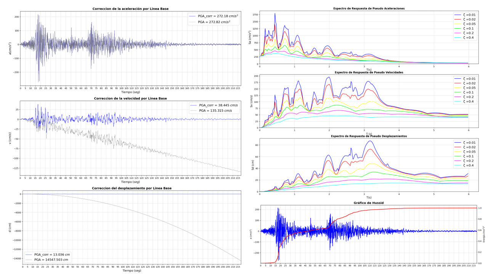
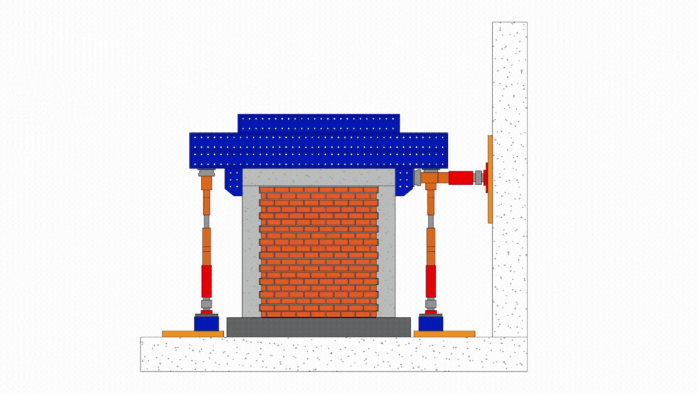
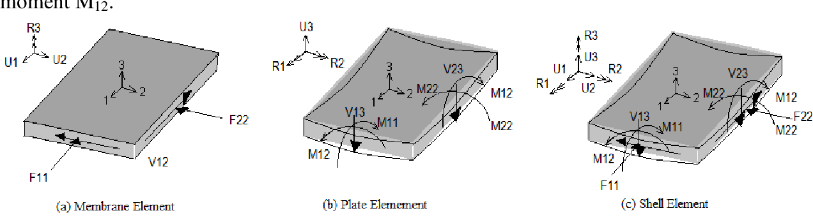
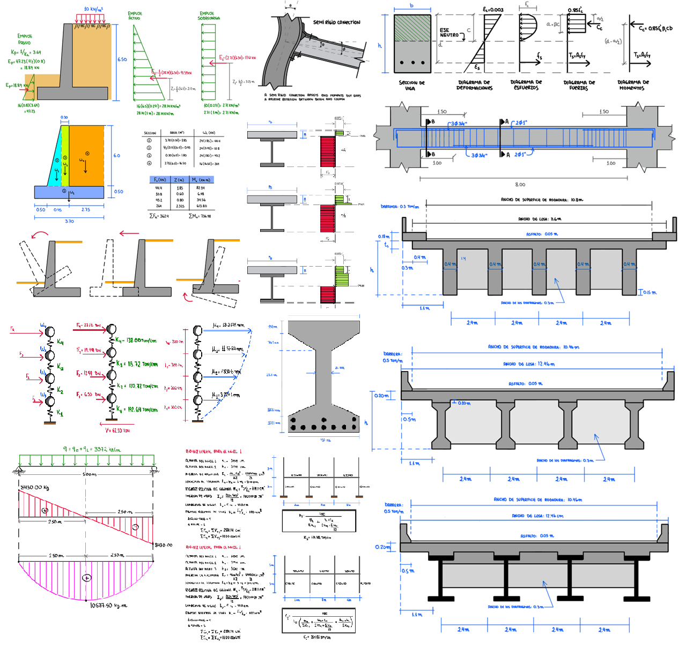
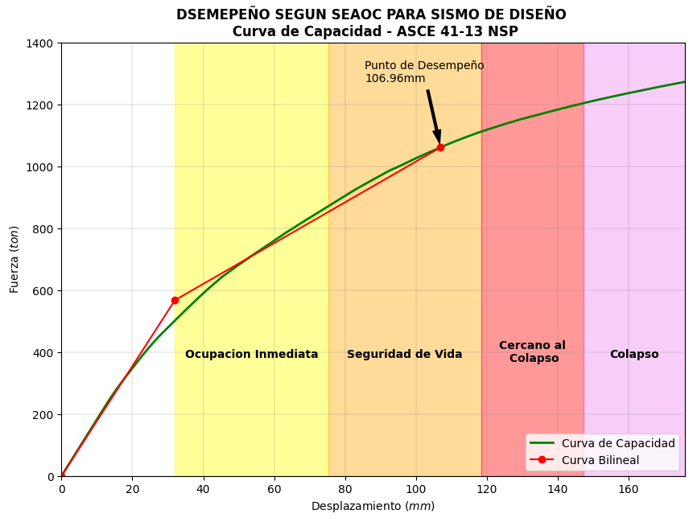
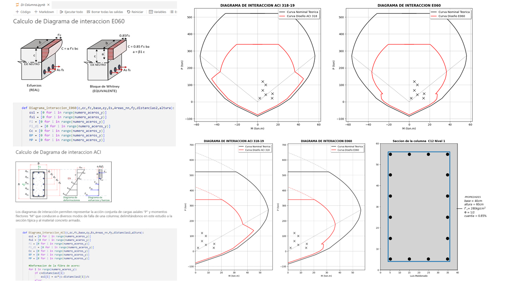

Mi primer portafolio elaborado en el curso de
**GESCONVIAL**.

# PROYECTOS DE INGENIERIA ESTRUCTURAL

En el que les presentaré los proyectos que he elaborado.

[Facebook](https://www.facebook.com/jesusmiguel.ariaszaldivar/)
[Instagram](https://www.instagram.com/jesusmiguelariaszaldivar/)
[Gmail](jesusmariasz.2020@gmail.com)

### *Enlaces externos*

### *Automatización del Análisis Sísmico*

Modelo ETABS para el análisis sísmico

### *Modelo para edificaciones*

Generación de edificaciones paramétricas

### *Registros sísmicos*

Registros sísmicos realizdos en los talleres

### *Registros sísmicos animados*

Registros sísmicos animados realizdos en los talleres

### *Automatización de generación de gráficos*

Realización de imagenes gifts

### *Apuntes estructurales*

Material elaborado en el curso de resistencia de materiales para estudiar y comprender el comportamiento de un elemento shell.

Graficos realizados en los cursos de análisis estructural

#### *Reporte no linear*

#### *Diseño sísmico*

Diagrama de Interacción de columnas rectangulares - ACI 318 y E.060

